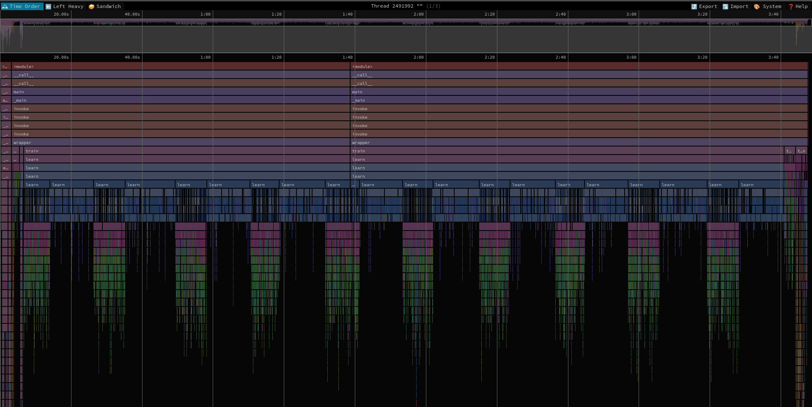

=========
Profiling
=========

`using py-spy <https://github.com/benfred/py-spy>`__

.. code-block:: console

    py-spy record - o ./profile.svg -- <command>

`speedscope integration <https://www.speedscope.app/>`__

.. code-block:: console

    py-spy record -f speedscope -o ./profile.svg -- <command>

*e.g.*

.. code-block:: console

    py-spy record -f speedscope -o ./profile.svg -- rr_trading alg train -c ./trading/configs/multi_ticker_ppo.json

