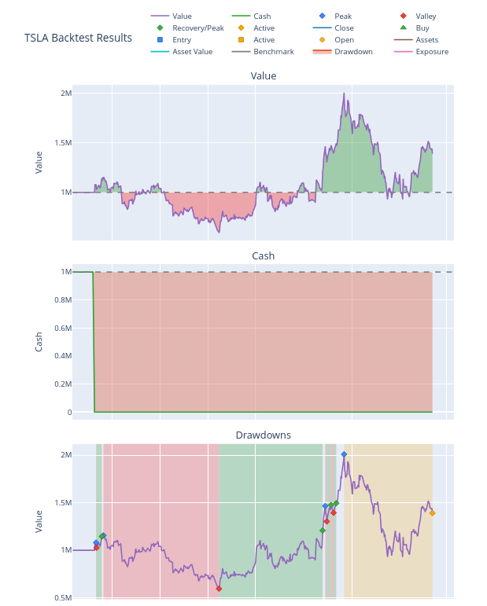

=====
Usage
=====

--------
Training
--------

.. code-block:: console

    rr_trading alg train -c <path_to_config>

.. code-block:: console

    rr_trading alg train --help                                                                                                                       
    Usage: rr_trading alg train [OPTIONS]                                                                                                                                          
                                                                                                                                                                                    
    ╭─ Options ────────────────────────────────────────────────────────────────────────────────────────────────────────────────────────────────────────────────────────────────────╮
    │ *  --config      -c      TEXT  Path to the configuration file. [default: None] [required]                                                                                    │
    │    --dry-run     -d            Run the training in dry run mode without saving results.                                                                                      │
    │    --no-test     -t            Run the backtesting suite via the new model                                                                                                   │
    │    --fetch-data  -f            Fetch the latest data before training. Do not use Cache.                                                                                      │
    │    --help                      Show this message and exit.                                                                                                                   │
    ╰──────────────────────────────────────────────────────────────────────────────────────────────────────────────────────────────────────────────────────────────────────────────╯

^^^^^^^^^^^
Tensorboard
^^^^^^^^^^^

Tensorboard output will be saved to `out_dir`

-----------
Backtesting
-----------

.. code-block:: console

    rr_trading alg backtest -c <path_to_config>
    Usage: rr_trading alg backtest [OPTIONS]                                                                                                                                       
                                                                                                                                                                                
    Run backtesting on the trained model.                                                                                                                                          
                                                                                                                                                                                    
    ╭─ Options ────────────────────────────────────────────────────────────────────────────────────────────────────────────────────────────────────────────────────────────────────╮
    │ *  --config    -c      TEXT  Path to the configuration file. [default: None] [required]                                                                                      │
    │    --on-train                Run backtesting on the training data instead of test data.                                                                                      │
    │    --help                    Show this message and exit.                                                                                                                     │
    ╰──────────────────────────────────────────────────────────────────────────────────────────────────────────────────────────────────────────────────────────────────────────────╯

.. code-block:: console

    rr_trading alg backtest --help      

^^^^^^^^
Analysis
^^^^^^^^

*Plots will be saved to `<out_dir>/backtest` and or rendered in browser if configured*

**Sample Backtest Results Rendering**

**Stats rendering**
::

    Stats:                                                                                                                                             
        Start                          2023-07-17 04:00:00+00:00                                                                                           
        End                            2025-06-04 04:00:00+00:00                                                                                           
        Period                                 474 days 00:00:00                                                                                           
        Start Value                                    1000000.0                                                                                           
        End Value                                     1181830.89                                                                                           
        Total Return [%]                               18.183089                                                                                           
        Benchmark Return [%]                            4.551781                                                                                           
        Max Gross Exposure [%]                         99.999854                                                                                           
        Total Fees Paid                                      0.0                                                                                           
        Max Drawdown [%]                                22.01912                                                                                           
        Max Drawdown Duration                  251 days 00:00:00                                                                                           
        Total Trades                                         222                                                                                           
        Total Closed Trades                                  221                                                                                           
        Total Open Trades                                      1                                                                                           
        Open Trade PnL                                1906.52112                                                                                           
        Win Rate [%]                                   57.466063                                                                                           
        Best Trade [%]                                 15.328848                                                                                           
        Worst Trade [%]                                -9.230098                                                                                           
        Avg Winning Trade [%]                           1.155003                                                                                           
        Avg Losing Trade [%]                           -1.281929                                                                                           
        Avg Winning Trade Duration    69 days 17:00:28.346456692                                                                                           
        Avg Losing Trade Duration     83 days 15:19:08.936170213                                                                                           
        Profit Factor                                   1.146855                                                                                           
        Expectancy                                    814.137416                                                                                           
        Sharpe Ratio                                    0.639243                                                                                           
        Calmar Ratio                                    0.623497                                                                                           
        Omega Ratio                                     1.161858                                                                                           
        Sortino Ratio                                   1.006545 

.. code-block:: console

    rr_trading alg analysis -c <path_to_config> -o <previous_run_output_dir>

.. code-block:: console

    rr_trading alg analysis --help      
    Usage: rr_trading alg analysis [OPTIONS]                                                                                                                                       
                                                                                                                                                                                    
    Run analysis on the backtest results.                                                                                                                                          
                                                                                                                                                                                    
    ╭─ Options ────────────────────────────────────────────────────────────────────────────────────────────────────────────────────────────────────────────────────────────────────╮
    │ *  --config   -c      TEXT  Path to the configuration file. [default: None] [required]                                                                                       │
    │ *  --out_dir  -o      TEXT  Path to the root output directory. [default: None] [required]                                                                                    │
    │    --help                   Show this message and exit.                                                                                                                      │
    ╰──────────────────────────────────────────────────────────────────────────────────────────────────────────────────────────────────────────────────────────────────────────────╯

-------------
Trading
-------------
Under construction

^^^^^^^^^^^^^
Paper Trading
^^^^^^^^^^^^^

^^^^^^^^^^^^^
Live Trading
^^^^^^^^^^^^^

